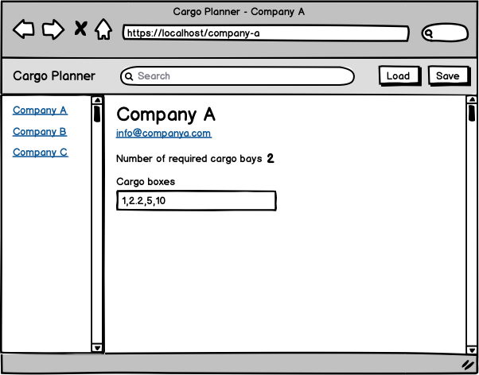

# SpaceX Cargo Planner

SpaceX is experiencing an increasing demand of shipments to Mars and has commissioned an application to automate the needed cargo space calculations.

## High level overview

The application should load existing set of shipments over the network. After which they can be filtered, viewed, edited and saved locally for later viewing.

As a first feature it will calculate the required number of cargo bays for each shipment. 

## UI



The application will mostly be used on desktop environments but it should be usable on smaller viewports too.

## Functionality

* When the user loads the application it first checks for locally saved shipments and loads them. In case there are none it displays a message asking to load a set over the network.

* Clicking the “Load” button loads all the shipments over the network from _shipments.json_ overwriting any existing ones.

* Clicking the “Save” button saves the existing state of shipments locally for later usage.

* Typing in a search box filters the existing list of loaded shipments by company name.

* Clicking a specific shipment displays the shipment details.

* Each shipment details view should have an unique URL.

* Changing the “Cargo boxes” field recalculates the needed number of cargo bays.

### Calculating the needed number of cargo bays

Each shipment specifies a comma separated string of cargo box units where each unit is represented by a number.

```JSON
{
  "id": "d3ff0c68892",
  "name": "Amazon.com",
  "email": "contact@amazon.com",
  "boxes": "6.8,7.9,3"
}
```

The following shipment consists of 3 cargo boxes with the following units 6.8, 7.9 and 3.

Each Starship cargo bay can hold up to **10** units.

The example shipment would require 2 cargo bays.

Another shipment `6.2,5.9,4,6.9,4.4,1.7,9.5` would require 4 cargo bays.

## Things we value

* Accessible markup
* Best practices
* Clean and understandable code

## Other

Author here, I appreciate any free time you spend on this. I put the assignment together around 3 areas: layout (HTML, CSS), library/framework knowledge (React, Vue.js, Angular) and your thinking in code. My advice is to first start with these areas and continue from there.

## Translate

# Планировщик грузов SpaceX

SpaceX испытывает растущий спрос на поставки на Марс и заказала приложение для автоматизации необходимых расчетов грузового пространства.

## Обзор высокого уровня

Приложение должно загружать существующий набор отправлений по сети. После чего их можно отфильтровать, просмотреть, отредактировать и сохранить локально для последующего просмотра.

В качестве первой функции он рассчитает необходимое количество грузовых отсеков для каждой партии груза. 

## Пользовательский интерфейс


Приложение в основном будет использоваться в среде настольных компьютеров, но его следует использовать и на небольших видовых экранах.

## Функциональность

* Когда пользователь загружает приложение, оно сначала проверяет наличие локально сохраненных отправлений и загружает их. В случае, если таковых нет, отображается сообщение с просьбой загрузить набор по сети.

* Нажатие кнопки “Загрузить” загружает все отправления по сети из _shipments.json_, перезаписывая все существующие.

* Нажатие кнопки “Сохранить” сохраняет существующее состояние локальных отправлений.

* Ввод в поле поиска фильтрует существующий список загруженных отправлений по названию компании.

* При нажатии на конкретную отправку отображаются сведения об отправке.

* Каждое представление сведений об отправке должно иметь уникальный URL-адрес.

* Изменение поля “Грузовые отсеки” пересчитывает необходимое количество грузовых отсеков.

### Расчет необходимого количества грузовых отсеков

В каждой отправке указывается строка единиц грузовых ящиков, разделенных запятыми, где каждая единица представлена номером.

``JSON
{
 "идентификатор": "d3ff0c68892",
"имя": "Amazon.com ",
"электронная почта": "contact@amazon.com ",
"боксы": "6.8,7.9,3"
}
```

Следующая партия состоит из 3 грузовых ящиков со следующими блоками 6.8, 7.9 и 3.

Каждый грузовой отсек звездолета вмещает до **10** единицы измерения.

Для примерной отправки потребуется 2 грузовых отсека.

Еще одна партия `6.2,5.9,4,6.9,4.4,1.7,9.5` потребовалось бы 4 грузовых отсека.

## Вещи, которые мы ценим

* Доступная разметка
* Лучшие практики
* Чистый и понятный код

## Другое

Автор здесь, я ценю любое свободное время, которое вы тратите на это.